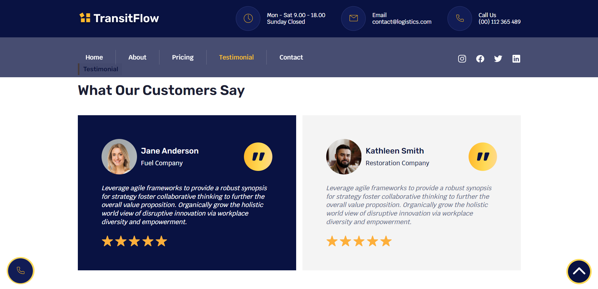
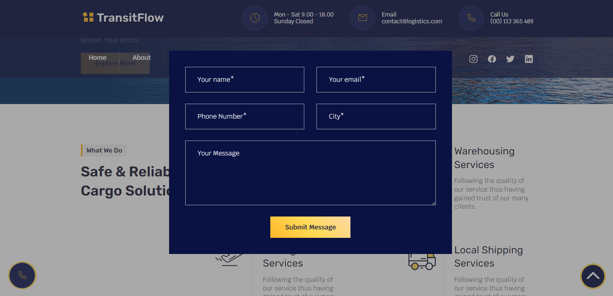

# Transit Flow

This educational project is an informational website for a logistics company. It is developed using HTML, SCSS, and JavaScript and incorporates popular libraries such as Bootstrap, Swiffy Slider, and AOS (Animate On Scroll). This project is built using Gulp and deployed on [000webhost](https://www.000webhost.com/).

## Features

- **Responsive Design:** The website is designed to be fully responsive and adaptable to different screen sizes and devices.

- **Interactive Slider:** The website includes an interactive carousel implemented using the Swiffy Slider library.

- **Smooth Animations:** Smooth animations are integrated to enhance the user experience.

- **Multi-Page Layout:** The website consists of several pages to provide detailed information about the logistics company's services and offerings.

- **Easy Navigation:** Anchor links are implemented for navigation between different sections and pages.

- **Burger Menu:** On smaller screens, a burger menu appears for easy navigation, implemented using Bootstrap.

- **Scroll-to-Top Button:** A scroll-to-top button is included for user convenience.

- **Animated Feedback Form Button:** An animated button triggers the appearance of a feedback form when clicked. It includes validation to ensure accurate data entry.

## Tech Stack

- HTML
- SCSS
- JavaScript
- Swiffy Slider
- Bootstrap
- Gulp

## Access the Website

You can access the website at the following link: [Transit Flow](https://transit-flow.000webhostapp.com/)

## Screenshots

_Home_

_Testimonial_

_Contact_

## Getting Started

git clone https://github.com/Nataly-Horbunova/transit_flow.git

cd transit_flow
